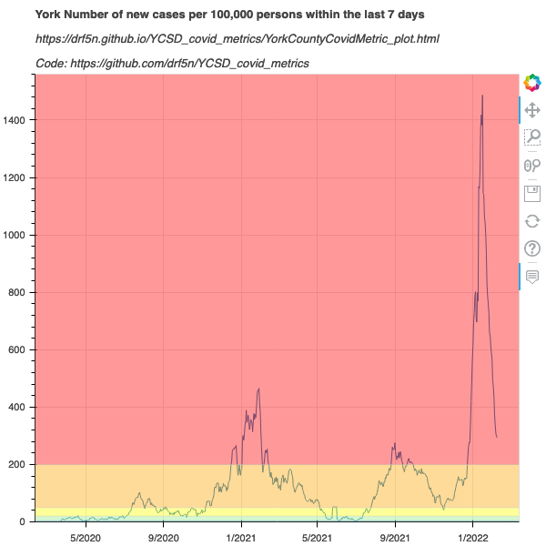
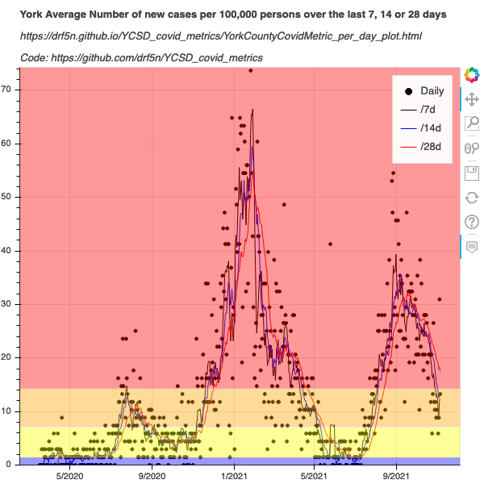
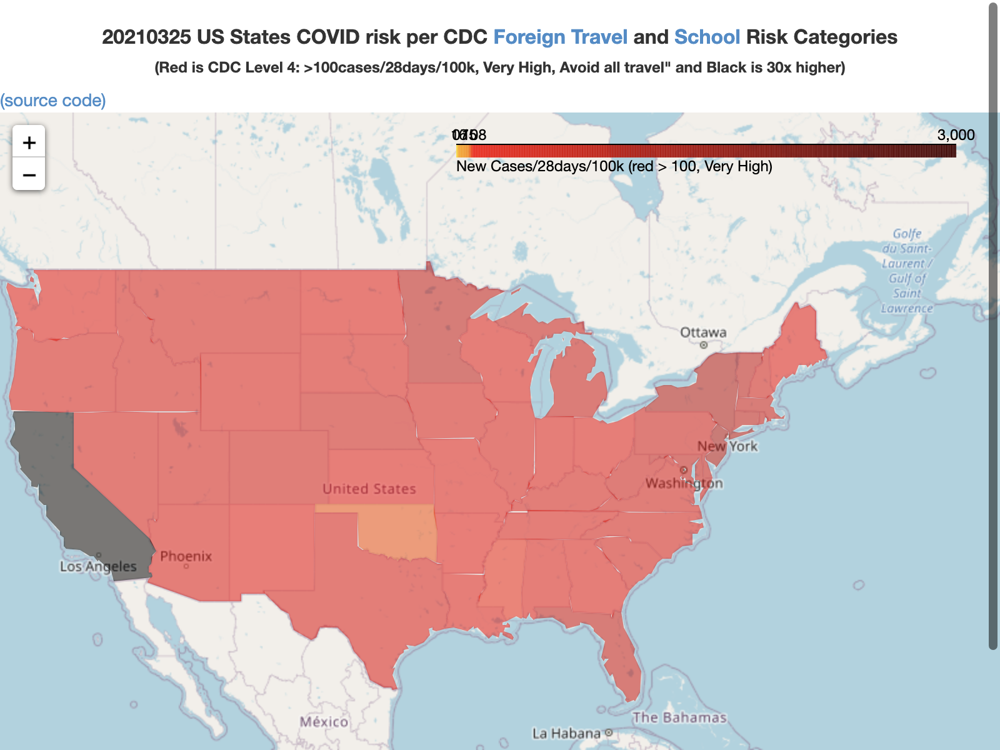
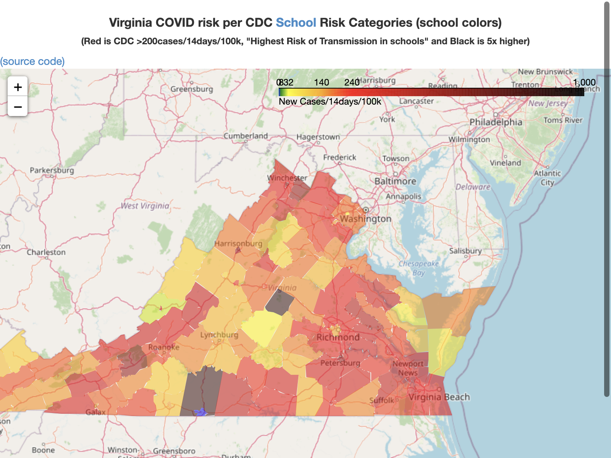
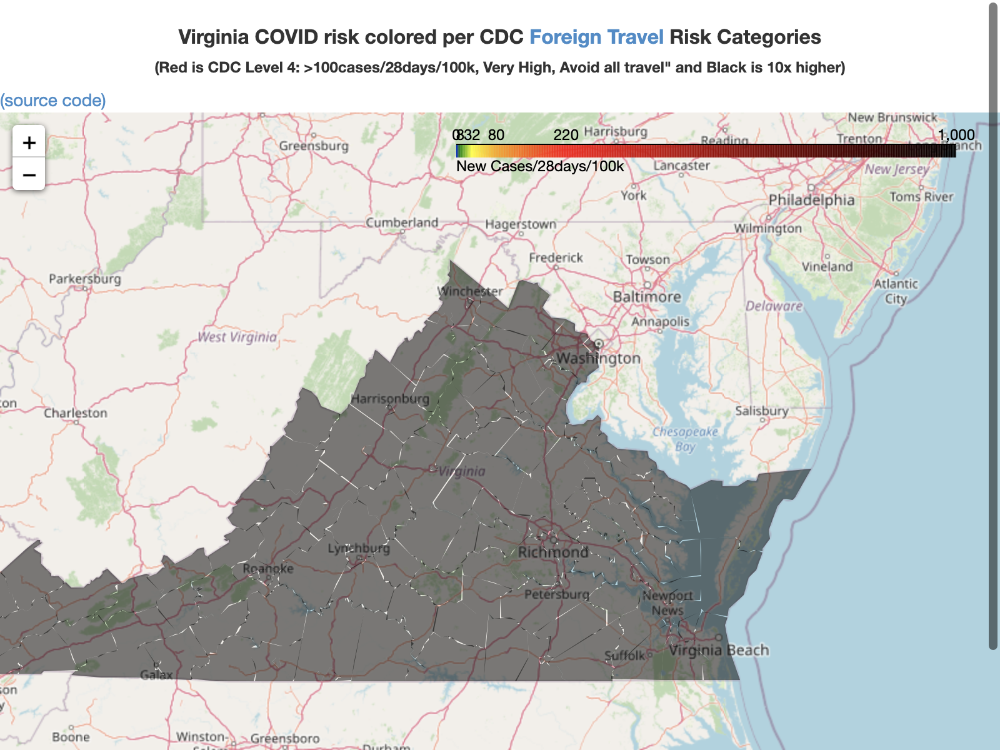
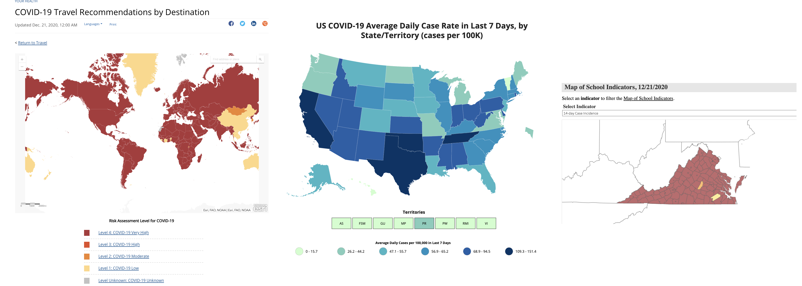

# YCSD_covid_metrics

On 2022-02-25, the CDC updated the commuity levels criteria and
thresholds a
https://www.cdc.gov/coronavirus/2019-ncov/science/community-levels.html
I've not updated the colors here, since the new colors depend on
primarily on hopitalizaion and beds, which is more difficult data to
extract. -- drf5n

These Jupyter notebooks aim to understand the data behind https://ycsd.yorkcountyschools.org/domain/1313 
that is derived from the data behind these sources:

* https://www.vdh.virginia.gov/coronavirus/key-measures/pandemic-metrics/school-metrics/
* https://www.vdh.virginia.gov/coronavirus/coronavirus/covid-19-in-virginia-locality/
* https://data.virginia.gov/Government/VDH-COVID-19-PublicUseDataset-Cases/bre9-aqqr

YCSD stopped tracking local community spread and the https://ycsd.yorkcountyschools.org/domain/1313 link is now empty. YCSD tracks only school cases and
cases and quarantine status at https://yorkcountyschools.org/parents/studentInfo/backtoSchool/Covid19Dashboard.html

The resultant plots are below. (Click on the plots to go to the live maps with annotations.)

* .
* .
* .
* .
* .

See these live maps and graphs at https://drf5n.github.io/index.html 

* https://drf5n.github.io/YCSD_covid_metrics/va_counties_map.html -- Virginia Counties colored by CDC Risk of Transmission in Schools category
* https://drf5n.github.io/YCSD_covid_metrics/va_counties_map_foreign.html -- Virginia Counties colored by CDC Foreign Travel Risk category
* https://drf5n.github.io/YCSD_covid_metrics/us_covid_states_map.html -- US states colored by CDC foreign country travel risk
* https://drf5n.github.io/YCSD_covid_metrics/YorkCountyCovidMetric_plot.html -- CDC School Transmission Risk timeseries for York County, VA. 

Coloring-wise it is interesting to compare the CDC's risk of foreign travel, the CDC risk of transmission in schools, and the CDC domestic travel maps.

The CDC's risk of foreign travel and CDC community transmission are both on a green-to-red continuum, with the foreign travel map being 4x more strict, but the CDC domestic travel is on a scale 1/4th of the CDC's foreign travel metric.

* [CDC Foreign Travel Advisories](https://www.cdc.gov/coronavirus/2019-ncov/travelers/map-and-travel-notices.html) -- Cases/28days/100k high = 100 Very High = 500
* [CDC Domestic travel risk](https://covid.cdc.gov/covid-data-tracker/#cases_casesper100klast7days) -- Cases/7day/100K 100 = High
* [CDC School risk Explanation](https://www.cdc.gov/coronavirus/2019-ncov/community/schools-childcare/k-12-guidance.html) & as [applied to Virginia Localities](https://www.vdh.virginia.gov/coronavirus/key-measures/pandemic-metrics/school-metrics/) -- Cases/7days/100k High = 100

Side by side, these Foreign, Domestic, and School categories and thresholds maps look like this:

-- Dave Forrest 2022-01-18
