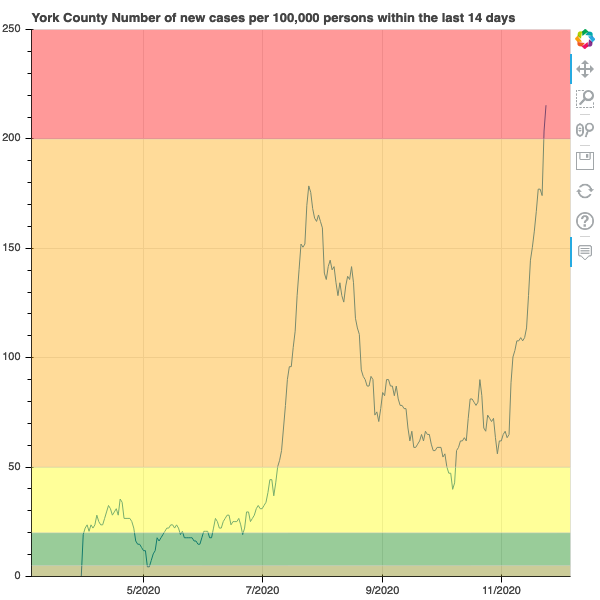

# YCSD_covid_metrics

These Jupyter notebooks aim to understand the data behind https://ycsd.yorkcountyschools.org/domain/1313 
that is derived from the data behind these sources:

* https://www.vdh.virginia.gov/coronavirus/key-measures/pandemic-metrics/school-metrics/
* https://www.vdh.virginia.gov/coronavirus/coronavirus/covid-19-in-virginia-locality/
* https://data.virginia.gov/Government/VDH-COVID-19-PublicUseDataset-Cases/bre9-aqqr

Also the US

The resultant plot is:  with the interactive in [YorkCountyCovidMetric_plot.html](YorkCountyCovidMetric_plot.html)

See these live maps and graphs at https://drf5n.github.io/YCSD_covid_metrics/index.html 

* https://drf5n.github.io/YCSD_covid_metrics/va_counties_map.html -- Virginia Counties colored by case risk
* https://drf5n.github.io/YCSD_covid_metrics/us_covid_states_map.html -- US states colored by CDC foreign country travel risk
* https://drf5n.github.io/YCSD_covid_metrics/YorkCountyCovidMetric_plot.html -- CDC School Transmission Risk timeseries for York County, VA. 

-- Dave Forrest 2020-12-09
