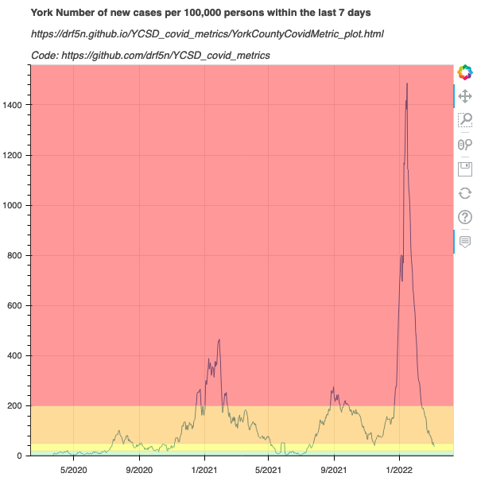
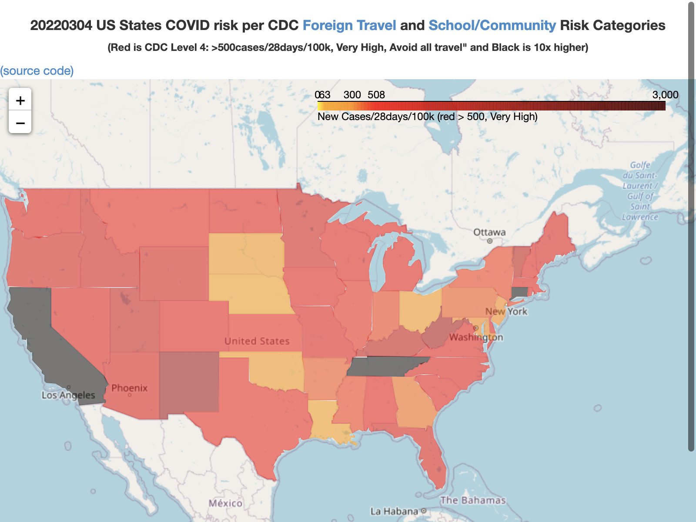
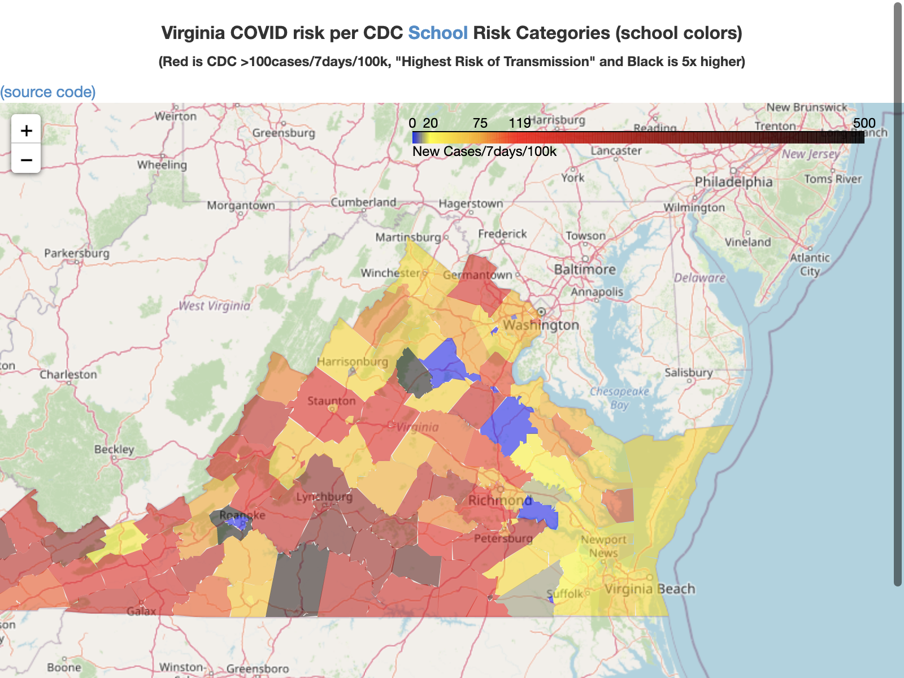
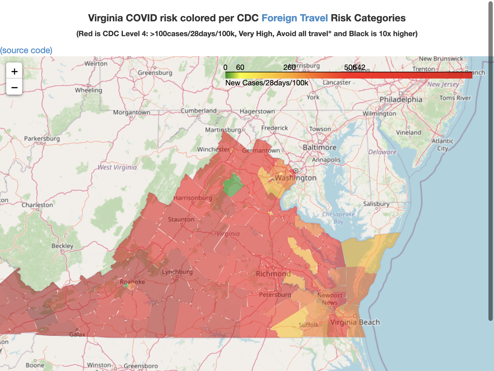

# YCSD_covid_metrics

These Jupyter notebooks aim to understand the data behind https://ycsd.yorkcountyschools.org/domain/1313 
that is derived from the data behind these sources:

* https://www.vdh.virginia.gov/coronavirus/key-measures/pandemic-metrics/school-metrics/
* https://www.vdh.virginia.gov/coronavirus/coronavirus/covid-19-in-virginia-locality/
* https://data.virginia.gov/Government/VDH-COVID-19-PublicUseDataset-Cases/bre9-aqqr

The resultant plots are below. (Click on the plots to go to the live maps with annotations.)

* .
* .
* .
* .

See these live maps and graphs at https://drf5n.github.io/YCSD_covid_metrics/index.html 

* https://drf5n.github.io/YCSD_covid_metrics/va_counties_map.html -- Virginia Counties colored by CDC Risk of Transmission in Schools category
* https://drf5n.github.io/YCSD_covid_metrics/va_counties_map_foreign.html -- Virginia Counties colored by CDC Foreign Travel Risk category
* https://drf5n.github.io/YCSD_covid_metrics/us_covid_states_map.html -- US states colored by CDC foreign country travel risk
* https://drf5n.github.io/YCSD_covid_metrics/YorkCountyCovidMetric_plot.html -- CDC School Transmission Risk timeseries for York County, VA. 

Coloring-wise it is interesting to compare the CDC's risk of foreign travel, the CDC risk of transmission in schools, and the CDC domestic travel maps.

The CDC's risk of foreign travel and CDC risk of transmission in schools are both on a green-to-red continuum, with the foreign travel map being more strict, but the CDC domestic travel is on a light green to blue continuum, showing numbers on a scale 1/28th of the CDC's foreign travel metric.

* [CDC Foreign Travel Advisories](https://www.cdc.gov/coronavirus/2019-ncov/travelers/map-and-travel-notices.html) -- Cases/28days/100k
* [CDC Domestic travel risk](https://covid.cdc.gov/covid-data-tracker/#cases_casesper100klast7days) -- Cases/day/100K
* [CDC School risk Explanation](https://www.cdc.gov/coronavirus/2019-ncov/community/schools-childcare/indicators.html#interpretation) & as [applied to Virginia Localities](https://www.vdh.virginia.gov/coronavirus/key-measures/pandemic-metrics/school-metrics/) -- Cases/14days/100k

Side by side, these Foreign, Domestic, and School categories and thresholds maps look like this:

-- Dave Forrest 2020-12-21
